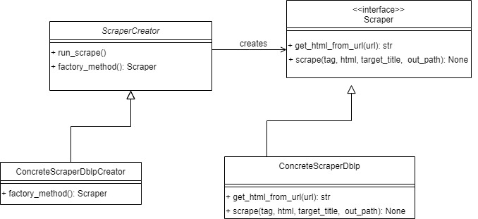
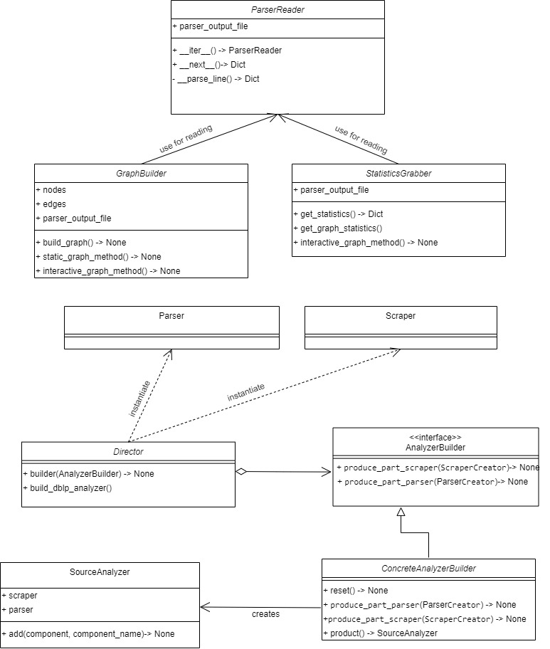

# Project Proposal

You can read the project proposal [here](project_proposal.md)

# Project Description


This python project aims to gather and visualize data regarding researchers and their collaborations in writing papers for journals and conferences
Data are collected by a Web Scraper module and then elaborated by a Parser.
Based on the output from the Parser, a set of baseline statistics (e.g. number of authors, average n. of paper per author, etc)
and a graph representation are computed.

The project is implemented to work with DBLP https://dblp.uni-trier.de/ as source of data, but
the code allows to easily add new Scrapers and Parsers in order extend its functionalities to new data sources.

In the proposal we mentioned also an interactive Web Page where the user could filter data based on its preferences, but we didn't managed to implement it due to lack of time.
Therefore at this step, the project can be run through Command Line Interface, as explained in the next paragraph.

## Usage

### How to run via CLI

- move into ddp_project directory

```bash
cd ddp_project
```
- run the project main script


```bash
python3 researcher_network.py
```
_Attention. Depending on your system configuration, you may need to use either python or python3 command_


You could also send parameters while calling the main script.
Please, look at the help menù
```bash
python3 researcher_network.py --help
```

### How to run tests
You should run setup.py script from the main directory of the project

```bash
python3 setup.py test
```

Alternatively, you could use your Python Editor/IDE if it has testing functionalities. If you choose this way, from the test configurations of the Editor, you must properly set the working directory to the project root directory.
For instance, pycharm set /ddp_project/ResearcherNetwork/tests as default.

### Requirements
- Strict requirements
    - Data Handling
        - pandas : used for reading csv
        - lxml : used for processing XML
        - unidecode : used for read data in Unicode format
        - beautifulsoup4 : used for pulling data from Html code
    - HTTP request handler
        - requests
    - File and Directory Handling
        - shutil
    - Testing libraries
        - pytest
    - Graphical Libraries
        - networkx : used for graph visualizations
        - bokeh : used for graph visualizations
        - matplotlib

- Optional
    - Graphical Libraries
        - graph-tool (see [intructions](https://git.skewed.de/count0/graph-tool/-/wikis/installation-instructions))   
    _We decided to make optional this requirements due to the difficulty in installing and running it in a Windows environment.
    However, it is easy to install under Linux and Mac OS. 
    Despite the possible compatibility issue with Windows, it has really good performance in rendering graphs and in exploration of them._
## The Process
The entire project process (including design and development phases) was composed by two iterations and
it was supported by a Kanban Board for tracking User Stories and relatives Tasks.
### Iteration 1

#### Plannig Game
The very first User Story of the project, User Story 1, states as follows:

_As a User, I want to access the system through CLI in order to get baseline statistics (i.e. number of authors)_.
In order to accomplish this story, we decided to split it in 6 Tasks (1 to 6 in the Kanban Board).
Tasks 1 to 5, which were necessary for implementing the main components, were faced during this iteration.
To sum up, the five tasks were about the implementation of the Web Scraper, Parser and the integration of both.
The acceptance tests were:
- the scraper is able to extract XML files from an HTML code (obtained from a given URL)
and store them locally.
- the parser can extract needed information from all the XML files and write them in a CSV file.

_Note. We omitted to test the function (i.e. a method of the Scraper) in charge of sending HTTP requests, because it relies on a well tested library
in python, named **requests** without additional code_

The expected time to accomplish those tasks was around 10 hours and the real development time met the expectations

#### Architecture
##### Class Digram


##### Design Choices
- We decided to implement both the Scraper and Parser components following the Factory Method creational pattern.
The choice was guided by the will to provide the possibility of easily adding different classes of scraping and parsing, depending on
future alternative data sources, without changing the code which actually uses them.

### Iteration 2
The second iteration started with the last task which makes the first user story completed, and finished with user story n.3.
In addition, after the User Story 3, the entire project went under a Refactoring process (including the implementation of Builder design pattern)
and the completion of the main script which runs all the functionalities implemented.

#### Plannig Game
- **User Story** 1: _As a User, I want to access the system through CLI in order to get baseline statistics (i.e. number of authors)_.
During this iteration we accomplished the Task 6 which consisted in computing the baseline statistics based on the Parser output analysis.
For the sake of clarity we report the statistics implemented till now:
    - total number of papers collected
    - total number of authors collected
    - average number of authors per paper
    - number of papers for each author
    - average number of papers per author
    - number of papers for each year
    - number of papers for each avenue (i.e. journal or conference)
    - author centrality*
    
    \* the centrality measure represents an importance indicator used in Social Network Analysis.
It is based on the number of connections that a node in the network has. In a undirected graph (i.e. as our case)
the centrality for an author (i.e. a node) is computed with the following formula:

    
    
    where :
    - _A_ represents an author (more precisely its node in the graph)
    - _edgesCount(A)_ is the amount of connection of _A_ (i.e. its edges)
    - _n_ is the total number of nodes in the graph (i.e. the number of authors)

    Acceptance test:

    - The module has to correctly compute the above statistics given the output of the Parser

- **User Story 2**: _As a User, I want to access the system through CLI in order to get a static Graph visualization_.
The python class containing methods which implement this feature is GraphBuilder (i.e. graph.py). 
At the time of instantiation, the constructor method (i.e. __init__) is in responsible for generate two lists
containing respectively the authors (i.e. nodes in the graph) and collaboration between them (i.e. egdes). 
In order to achieve that, it relies on a Iterator (located into helper_function.py), named ParserReader,
which reads and returns data (as dictionary) from the output file of the Parser module.
The implementation was split up in two tasks, i.e. Task 8 and Task 9 from the Kanban board.
Each task consists in building and rendering (i.e. a static snapshot for these two task) the graph leveraging on two different library:
networkx and graph-tool. The latter has better performance (less time consuming) and a nicer quality of the render.

    Acceptance tests:
    
    - given an output from the Parser, the lists of nodes and edges are equals to all the authors
    and corresponding collaborations written in the file
    - the graph built with both the libraries, contains the right collection of authors (nodes) and
    collaborations (edges)
    - the methods in charge of printing the snapshots, correctly generate a .jpg file in a given path
    - given a list of wanted authors, both the rendering methods should write a label, 
    corresponding to the author's name, only on those authors' nodes

- **User Story 3**: _As a User, I want to access the system through CLI in order to get an interactive Graph visualization_.
Now, the Graph class is enriched with 3 methods in order to realise interactive visualizations
for the previous built graphs. This story was divided into Task 9 and Task 10. 
In addition, we introduced a third library for rendering, that is called Bokeh. It leverages on
the networkx graph for building the structure, and then tries to make a better
graphic representation than the one made by the former lib. For example, it allows to read info about a node
just going over with the pointer, differently from networkx where if you want all the labels, those are badly
display on the graph, making tough the visualization.

    Acceptance tests:
    
    - the methods which display the bokeh visualization has to write an HTML
    file to a given path
    
    _We were able to test only this method because both networkx and graph-tool directly
    open an interactive windows without generating files_

- **Further Refactoring**:
Once the previous user stories and relative tasks were done, the whole code
went under a refactoring process in order to make the code more readable and,
in some cases, better scalable.
 
- **Final Integration and test**:
We implemented a main script which, given some optional user input (via CLI), run all the 
needed components and returns to the user, statistics and the graph on data from target source
 
#### Architecture
##### Class Digram


_In order to keep the diagram as clear as possible, we replace the real structure of Parser and Scraper classes
with two placeholder. The actual structure of those classes is reported as UML diagram in Iteration 1._

_Let us avoid to write every methods of the Graph Builder class in order to keep the diagram short.
We summarized using just 3 methods: one for building the graph structure, one for 
rendering a static graph and one for the interactive graph._ 
 

##### Design Choices
- We adopted the Iterator design pattern to implement ParserReader class. It is in charge of
reading the parser output file and return data in a more comfortable structure. It does the job
hiding the complexity of the parser output and let us change it easier in the future, for example
to consider changes in the parser output due to new data sources.

- As result of the last refactoring step, we implemented the Builder design patterns
to let this project to be extended with new data sources which might either need to reuse existent
Scraper/Parser or new implementations of them. Therefore, based on the data source selected
(e.g. by the user input), the builder will choose the right components (e.g. which scraper among all)
to use.


The expected time to accomplish those tasks was around 12 hours and the real development ....


## Considerations:

