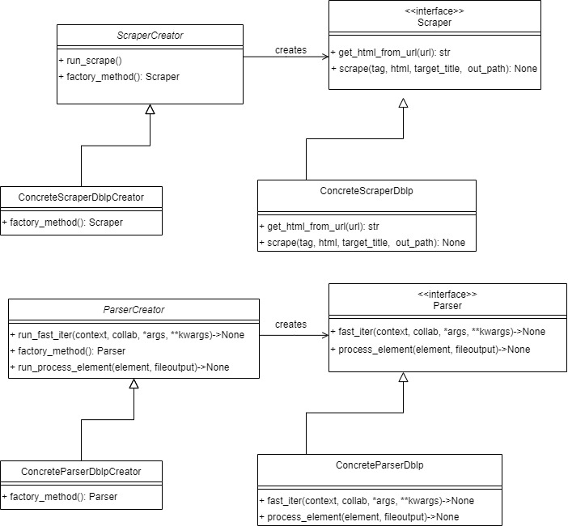

# Project Proposal

You can read the project proposal [here](project_proposal.md)

# Project Description


This python project aims to gather and visualize data regarding researchers and their collaborations in writing papers for journals and conferences
Data are collected by a Web Scraper module and then elaborated by a Parser.
Based on the output from the Parser, a set of baseline statistics (e.g. number of authors, average n. of paper per author, etc)
and a graph representation are computed.

The project is implemented to work with DBLP https://dblp.uni-trier.de/ as source of data, but
the code allows to easily add new Scrapers and Parsers in order extend its funcionalities to new data sources.

In the proposal we mentioned also an interactive Web Page where the user could filter data based on its preferencies, but we didn't managed to implement it due to lack of time.


## Usage

### How to run via CLI

- move into ddp_project directory

```bash
cd ddp_project
```
- run the project main script


```bash
python3 researcher_network.py
```
_Attention. Depending on your system configuration, you may need to use either python or python3 command_


You could also send parameters while calling the main script.
Please, look at the help menù
```bash
python3 researcher_network.py --help
```

### How to run tests
You should run setup.py script from the main directory of the project

```bash
python3 setup.py test
```

Alternatively, you could use your Python Editor/IDE if it has testing functionalities. If you choose this way, from the test configurations of the Editor, you must properly set the working directory to the project root directory.
For instance, pycharm set /ddp_project/ResearcherNetwork/tests as default.

### Requirements
- Strict requirements
  - pandas
  - shutil
  - beautifulsoup4,
  - requests,
  - unidecode,
  - lxml,
  - pytest,
  - networkx,
  - matplotlib,
  - bokeh

- Optional
  - graph-tool (see [intructions](https://git.skewed.de/count0/graph-tool/-/wikis/installation-instructions))

## The Process
The entire project process (including design and development phases) was composed by two iterations and
it was supported by a Kanban Board for tracking User Stories and relatives Tasks.
### Iteration 1

#### Plannig Game
The very first User Story of the project is the following:
_As a User, I want to access the system through CLI in order to get baseline statistics (i.e. number of authors)_
In order to accomplish this story, we decided to split it in 6 Tasks (1 to 6 in the Kanban Board).
Tasks 1 to 5, which were necessary for implementing the main components, were faced during this iteration.
To sum up, the five tasks were about the implementation of the Web Scraper, Parser and the integration of both.
The acceptance tests were:
- the scraper is able to extract XML files from an HTML code (obtained from a given URL)
and store them locally.
- the parser can extract needed information from all the XML files and write them in a CSV file.

_Note. We omitted to test the function (i.e. a method of the Scraper) in charge of sending HTTP requests, because it relies on a well tested library
in python, named **requests** without additional code_

The expected time to accomplish those tasks was around 10 hours and the real development time met the expectations

#### Architecture
##### Class Digram


##### Design Choices
- We decided to implement both the Scraper and Parser components following the Factory Method creational pattern.
The choice was guided by the will to provide the possibility of easily adding different classes of scraping and parsing, depending on
future alternative data sources, without changing the code which actually uses them.

### Iteration 2


